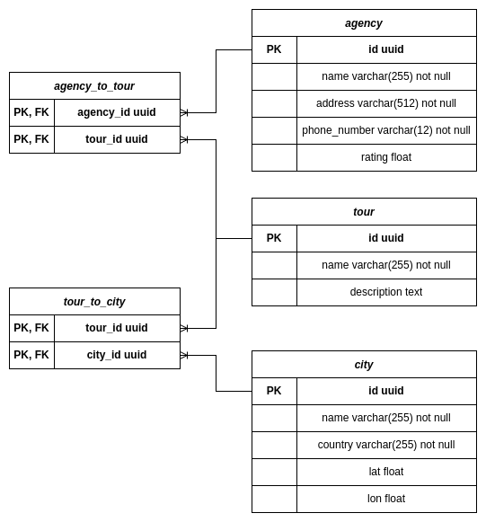

## ER-Schema

<picture>
 <source media="(prefers-color-scheme: dark)" srcset="er_schemas/er_schema_dark.png">
 
</picture>

## Запуск

### 1. Установка
* [Docker](https://docs.docker.com/engine/install/ubuntu/#install-using-the-convenience-script)
* [Docker Compose](https://docs.docker.com/compose/install/)

### 2. Клонирование
```
git clone https://github.com/rTiRe/crud_tours.git
cd crud_tours
```

### 3. Создание файла окружения
В основной папке присутствует файл-пример `.env.example`.
Для начала работы его достаточно переименовать в `.env`, но, конечно, желательно поменять значения.
* `POSTGRES_HOST` - адрес postgres.
* `POSTGRES_PORT` - порт, на котором запущена БД
* `POSTGRES_DB` - имя используемой базы данных
* `POSTGRES_USER` - имя пользователя postgres
* `POSTGRES_PASSWORD` - пароль postgres
* `FLASK_PORT` - порт, на котором запущен Flask

> [!IMPORTANT]
> `POSTGRES_HOST=host.docker.internal` если запуск будет производиться через `docker compose up`
> Если запуск будет производиться в `dev mode`, то необходимо указать точный адрес базы данных.

### 4. Управление контейнером

#### Запуск
```
docker compose up
```
#### Запуск в detach режиме
```
docker compose up -d
```
#### Запуск с пребилдом
```
docker compose up --build
```
#### Остановка
```
docker compose stop
```
#### Остановка + удаление
```
docker compose down
```
#### Запуск без docker compose (dev mode)
Для того, чтобы запустить `flask` через консоль или дебаггер, нужно в папке с проектом выполнить следующие команды:
```
python3 -m venv venv
. ./venv/bin/activate
pip install -r requirements.txt
python app.py
```
> [!IMPORTANT]
> Необходимо проверить [файл окружения](#3.-Создание-файла-окружения)